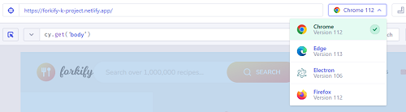
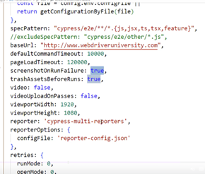
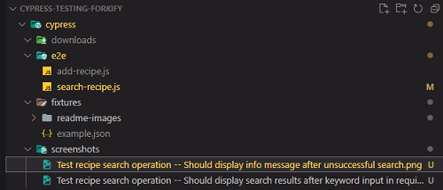
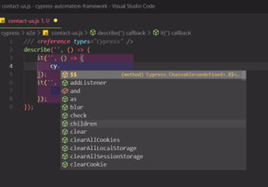
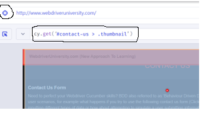
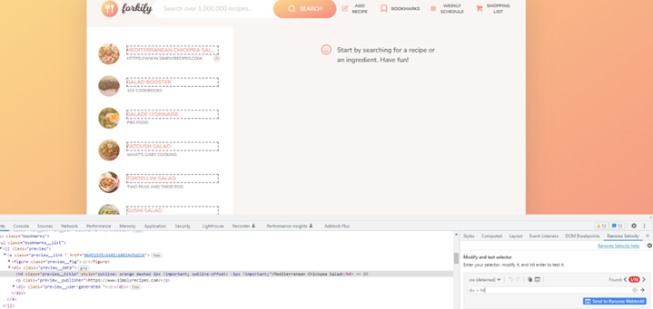

# Project for testing [https://forkify-k-project.netlify.app/](https://forkify-k-project.netlify.app/) using Cypress automation framework

-   **Cypress** is a next generation front end testing tool built for the modern web, used for setting, writing, running and debugging tests. It is open source and runs on Windows, Linux, and macOS. It is often compared to Selenium, however, it runs inside the browser and it uses JavaScript and nodeJS. For this purpose it is needed to download and install node JS. Git also needs to be installed on our machine in order to be able to use Git Bash for running commands with Visual Studio Code terminal (this is a recommendation, another IDE can also be used).
-   **End to end testing** is a software testing method that evaluates the entire application from start to finish, in an environment that is similar to production. It checks the integration of the software's dependencies and the flow of data for all kinds of user tasks and processes. It occurs after integration testing and system integration testing, which test the individual components of a system. It is necessary to ensure that a complete system or application interacts correctly with different dependent systems and apps for a core enterprise business process. It is not a form of testing a completed product, but a way of assessing the working order of a complex product under real-world scenarios.
-   Cypress enables **all types of tests**: end-to-end tests, component tests, integration tests, unit tests.

## Cypress features:

1. **Time Travel**: Cypress takes snapshots as your tests run. Hover over commands in the Command Log to see exactly what happened at each step.
2. **Debuggability**: offers readable errors and stack traces for fast debugging.
3. **Automatic Waiting**: cypress automatically waits for commands and assertions before moving on.
4. **Spies, Stubs, and Clocks**: features to verify and control the behavior of functions, server responses, or timers.
5. **Network Traffic Control**: control, stub, and test edge cases without involving a server.
6. **Consistent Results**: fast, consistent and reliable tests without Selenium or WebDriver.
7. **Screenshots and Videos**: screenshots taken automatically on failure, or videos of an entire test suite when run from the CLI. Screenshots and videos can be recorded to Cypress Cloud and stored with test results for zero-configuration debugging.
8. **Cross Browser Testing**: tests can run using Firefox and Chrome-family browsers (including Edge and Electron) locally and optimally in a Continuous Integration pipeline.
9. **Smart Orchestration**: by setting up to record to Cypress Cloud, a test suite can be parallelized, failed specs can rerun first with Spec Prioritization, and test runs can be canceled on failures with Auto Cancellation for tight feedback loops.
10. **Flake Detection**: enables discovering and diagnosing unreliable tests with Cypress Cloud's Flaky test management.

## Setting up our project

1.  Root project directory **cypress-testing-forkify** is created. This test project was built by using **Visual Studio Code** IDE which also needs to be installed.
2.  Initializing **package.json** file by using the following command via **Git Bash** terminal (Terminal -> New Terminal -> Select Bash on bottom right): `npm init`.
3.  Install cypress framework using this command: `npm install --save-dev cypress@12.6.0`. This will add **node_modules** directory in the project root directory. When copying this project this directory doesn't have to be transferred together with project content because it can easily be added in the same manner as described above.

    -   **Note:** Installed version matches one used in Udemy tutorial [https://www.udemy.com/course/cypress-io-master-class](https://www.udemy.com/course/cypress-io-master-class).

4.  Running **Cypress App**: `./node_modules/.bin/cypress open`. This will start cypress-automation-framework (master) page where we can select E2E tests from available two options. Selecting it will add all necessary configuration files. We can select to start the test runner with chrome tests and then create example specs (tests). In our project directory, this will add the cypress directory where we can find the specs in the e2e directory. Following Version 10, Cypress test runner is called the **Cypress App**. Cypress app provides easy way to execute tests, each file displayed on the app’s UI is a test, and can be run in the Cypress App by simply clicking on it.

    -   In the **package.json** file commands for starting Cypress can be added by adding this line to the scripts section: `"cypress:open": "cypress open"`. This way, Cypress can be started by simply writing: `npm run cypress:open` in the Bash terminal.

    -   When we visit a site while performing tests with cypress, the framework picks up on some additional information like XHR logs and can detect some errors on loading which is particularly useful for developers. In the Cypress App executed cypress commands are written in bold text. - Tests can be run in different browsers and selecting a browser is very simple by using the Cypress App.

    

    -   **Note:** In the example tests/specs the extension **cy.js** is used. To use another extension we need to modify file: **cypress.config.js** by adding line:

    ```
    specPattern:"cypress/e2e/**/*.{js,jsx,ts,tsx,feature}"
    ```

    The stars are wild cards (any folder \*_, any file _). We add this line to the e2e block.

## Project structure

-   Tests (specs) can be found in directory **cypress/e2e** (formally called **integration**).
-   **Fixtures** directory is used to store data providers, files containing data that can be used as input for tests.
-   Common commands that are very likely to be used in multiple tests are stored in the **support** directory, more precisely in the **commands.js** file. This prevents repeating code.
-   In that same directory is the **e2e.js** file where we can add external plugins that can be used in our framework. An example of that is adding the **XPath** plugin by adding line: `require("cypress-xpath");` to the file content.
-   If there are files downloaded while certain tests are executed they will be stored in the **downloads** folder.
-   Configuration properties are defined in the **cypress.config.js** file. Example:

    

As shown in the image above, the baseURL of the application under test can also be defined in this file, by adding line:

```
baseUrl: "https://forkify-k-project.netlify.app/"
```

-   Following execution, **json reports** can be saved in the **results** directory.
-   In the **screenshots** directory images of executed tests are stored.

    -   **Note**: to achieve this Cypress method **screenshot()** needs to be used on a specific element. After the test is successfully executed, screenshot of the selected element can be found in the **screenshots** directory:

    

-   Cypress also has the capability to record text execution and videos are saved in the corresponding **videos** directory.

## Using **Mocha**

-   Cypress framework is a JavaScript-based end-to-end testing framework built on Mocha – a feature-rich JavaScript test framework running on **Node.js** ( an open-source, cross-platform, asynchronous event-driven JavaScript runtime that executes code outside of the browser) and in the browser, making asynchronous testing simple and convenient. Mocha tests run serially, allowing for flexible and accurate reporting, while mapping uncaught exceptions to the correct test cases. Hosted on GitHub, Mocha comes pre bundled with two function calls:

    -   **describe()**: used to group tests in Mocha, basically groups a series of tests together. This function takes two arguments: the name of the test group and the callback function (function accessible by another function, called after the first function has successfully finished executing).
    -   **it()**: a way to describe each individual test case which is nested inside the describe block. **it()** should be described in a way that makes sense for the given test case.

## Basic Cypress commands

To be able to use Cypress commands it is necessary to specify the file will be referencing Cypress:

```
/// <reference types="Cypress" />
```

After adding reference, Visual Studio Code enables easy access to all Cypress commands used to write tests, like **get()** for accessing DOM elements by using selectors or **visit()** for accessing a specific URL.



## Web elements and selectors

-   The **DOM (Document Object Model)** defines a standard for accessing documents, more precisely a platform and language-neutral interface that allows programs and scripts to dynamically access and update the content, structure, and style of a document. If web content is written in Java Script for example, it is the interface between that code and the HTML documents that are rendered in or by the browser. A tree-like structure made out of nodes is generated for HTML documents, called the **DOM tree**. The DOM tree represents the elements as nodes and there is a hierarchy (for example, element HTML is the parent of head and body which are siblings). So basically, web elements are accessed by using the generated nodes in the DOM tree structure.
-   In Cypress, web elements are accessed by using selectors. When a test is run using the Cypress App a tool for automatically defining selectors is available. First, the tool is activated and then by clicking on a specific element a selector is generated:

    

    This selector is then used to access the specified element: `cy.get('#contact-us > .thumbnail').click();`.

### Using options with **click()**

-   Sometimes an element is visible in the DOM but can not be accessed because of a certain setting. In this case, certain options need to be passed together with the click command. If an element is not accessible the **force** option is used which forces the action and disables the waiting for actionability property: `cy.get('textarea.feedback-input').type('Enter comment here', {force:true})`.

-   In the script **cypress/e2e/search-recipe.js** a test suite is written for testing the **Search** feature of the demo app.

    -   The first test describes a happy path where a list of recipe previews is shown in the search results area of the page.
    -   The second test describes an unhappy path where a search when query text **yellow** is entered gives no results. Corresponding message is also displayed to the user.

-   **Note**: By using the \*\*only\*\* command Mocha is directed to execute only that test. To execute all test cases in test suite, remove **only** after **it()** command in the first test of the suite. The **skip** commands will cause Cypress to ignore that test case.

### Selectors

To easily define correct selectors Chrome plugin **Ranorex celocity** can be added to the browser. When using Ranorex Celocity in Chrome, an element can be selected using the **select element** tool (right-click -> inspect) and inspecting the element a type or attribute can be used, like so: `a > ul`. This means that an unordered list element will be selected that is embedded in an anchor element. In the Forkify app, `div > h4` can be used to select all recipes that appear in search results. After that, several selector options are offered in the **List of selectors** area. To select a specific heading of a recipe in search results, following XPath: `(//h4[text()="Mediterranean Chickpea Salad"])` can be used.



-   **Note**: it is highly advisable to add custom attributes (like name, id, specific class and so on) when creating web elements so they are easily accessed when testing.

-   Generated selectors are not robust enough because they often don't use specific attributes for the element that needs to be selected. For example, the following generated selector: `cy.get(".info_links_footer > :nth-child(5) > a")` can easily select the wrong element if the order of elements in the DOM is modified.

-   A **class selector** is a name preceded by a full stop (“.”), example: **.subcategories**.
    -   **Note**: a class selector is a typical CSS selector. When using CSS selector the **\$** symbol stands for **ends-with** and the **\^** symbol stands for **starts-with**. For example: `a[class^="twitter"]` will select an anchor element with class attribute starting with **twitter** and selector `button[class$="add-recipe"]` will select button element with class attribute ending in **add-recipe**.
-   An **ID selector** is a name preceded by the hash character (“#”), example **#homepageHeader**. Documentation on CSS selectors: [https://developer.mozilla.org/en-US/docs/Web/CSS/CSS_Selectors](https://developer.mozilla.org/en-US/docs/Web/CSS/CSS_Selectors) and here [https://www.tutorialspoint.com/xpath/index.htm](https://www.tutorialspoint.com/xpath/index.htm).
    -   **Note**: While ID is used to identify only one element, a class can be used to identify more than one element. A combination of these selectors can also be used, as shown in example above: `'#contact-us > .thumbnail'`. This way, a child element, with class attribute ".thumbnail", of of the element with id "contact-us" is selected.
-   **XPath** selectors. Full documentation can be found here [https://www.w3schools.com/xml/xpath_syntax.asp](https://www.w3schools.com/xml/xpath_syntax.asp). These selectors usually start with **//** which means they are relative and all elements will be selected no matter where they are in the document. For absolute XPath **/** is used and elements are selected starting from the root of the document. The star symbol (**\***) represents a wild card. The **@** symbol is used to access an attribute: `//input[@id="quantity"]`. - An XPath expression often contains functions, like for example the string function **text()**: `//p[text()="Start by searching for a recipe or an ingredient. Have fun!"]`, **contains()**: `//div[contains(@class,"search")]` or **starts-with()**: `//input[starts-with(@placeholder,"Search")]`.
-   **XPath Axes** [https://www.w3schools.com/xml/xpath_axes.asp](https://www.w3schools.com/xml/xpath_axes.asp) are also very useful when writing XPath expressions. An axis is used to locate nodes relative to the current node on the tree. Basically, relations between nodes in the DOM tree can be used to select an element, for example: `//input[@id="description"]/following-sibling::textarea`.

### Example using **XPath** plugin for VS Code

-   In order to use **XPath** selectors in Cypress a plugin [https://www.npmjs.com/package/@cypress/xpath](https://www.npmjs.com/package/@cypress/xpath) needs to be added in VS Code, using command: `npm install --save-dev @cypress/xpath`.
-   Inside the **e2e.js** file (Located inside the support folder), simply add: `require('@cypress/xpath')`;
-   In the script **cypress/e2e/add-recipe.js** a test suite is written for testing the **Add Recipe** feature of the demo app.

    -   The first test describes a happy path where all data is entered in the correct format. After uploading entered data corresponding message of successful recipe upload is displayed.
    -   The next two tests describe unhappy paths where not all data is entered and data is entered in invalid format. In the first case, user is notified about missing data and in the second a message is displayed stating that format used to enter ingredient data is invalid.
    -   The last tests case describes a happy path for deleting the recipe the user has entered. This test case is added to avoid duplicate data anytime the suite is executed.

## Page Object Model Pattern in Cypress (example)

Page Object Model is a design pattern in the automation world which has been famous for its **easy maintenance** approach and **avoiding code duplication**. A page object is a class that represents a page in the web application. Under this model, the overall web application breaks down into logical pages. Each page of the web application generally corresponds to one class, but can even map to multiple classes also, depending on the classification of the pages. This Page class will contain all the locators of the WebElements of that web page and will also contain methods that can perform operations on those WebElements.

-   In the **cypress/pages** directory, example classes: **HomePage**, **Header**, **Recipe**, **Search**, **SearchResults** are included.
-   The tests using these classes (pages) are: **testHeader**, **testSearch**, **testHomePage.js**, **testRecipeView.js** and **testSearchResults** correspondingly.

    -   **Note**: some test suites contain **Cypress Hooks** ([https://docs.cypress.io/guides/core-concepts/writing-and-organizing-tests#Hooks](https://docs.cypress.io/guides/core-concepts/writing-and-organizing-tests#Hooks)) which are constructs used for performing a particular set of actions just **before/after each test case** or **before/after all the test cases** in the test suite. \
        In the same suite there are tests referencing windows by using commands like:

    ```
    cy.document().should("have.property", "charset").and("eq", "UTF-8");
    ```

    Cypress **fixture** `cypress/fixtures/example.json` ([https://docs.cypress.io/api/commands/fixture#Syntax](https://docs.cypress.io/api/commands/fixture#Syntax)) is also used to store test data in **JSON** format, that is referenced in the tests enabling data-driven testing (same test can be performed several times using different tests of data, giving varying results).

## Promises in Cypress and the **wrap()** method.

Cypress runs asynchronously and promises are handled in the background. However, when the order of executions needs to be defined explicitly, **then()** can be used to handle promises. This topic is explained in detail here [https://docs.cypress.io/guides/core-concepts/introduction-to-cypress#Subject-Management](https://docs.cypress.io/guides/core-concepts/introduction-to-cypress#Subject-Management).

-   **Note**: Class **cypress/pages/Search.js** contains a method that has an example of using **then()** method to handle a promise and control order of execution. Class **cypress/pages/SearchResults.js** contains examples of using promises to access values like the length of the yielded list of elements abd methods that clicks on a random element of the yielded list, that also requires using the **then()**method.

Cypress **wrap()** method is also often used to handle promisers, more precisely it is used to yield the object passed into 'wrap()'. If the object is a promise, it will yield its resolved value. It can be used with objects:

```
//Invoke the function on the subject in wrap and return the new value
const getName = () => {
  return 'Jane Lane'
}
cy.wrap({ name: getName }).invoke('name').should('eq', 'Jane Lane') // true
```

and also to wrap elements to continue the commands chain of execution:

```
cy.get('form').within(($form) => {
  // ... more commands

  cy.wrap($form).should('have.class', 'form-container')
})
```

You can wrap promises returned by the application code. Cypress commands will automatically wait for the promise to resolve before continuing with the yielded value to the next command or assertion. See [https://docs.cypress.io/examples/recipes#Logging-In](https://docs.cypress.io/examples/recipes#Logging-In) for the full example.

```
const myPromise = new Promise((resolve, reject) => {
  // we use setTimeout(...) to simulate async code.
  setTimeout(() => {
    resolve({
      type: 'success',
      message: 'It worked!',
    })
  }, 2500)
})

it('should wait for promises to resolve', () => {
  cy.wrap(myPromise).its('message').should('eq', 'It worked!')
})
```

## Invoke and alias

Invoke a function on the previously yielded subject.

If you want to get a property that is not a function on the previously yielded subject, use .its().

If you chain further commands off of .invoke(), it will be called multiple times. If you only want the method to be called once, end your chain with .invoke() and start fresh with cy afterwards.

```
cy.get('.input').invoke('val').should('eq', 'foo') // Invoke the 'val' function
cy.get('.modal').invoke('show') // Invoke the jQuery 'show' function
cy.wrap({ animate: fn }).invoke('animate') // Invoke the 'animate' function
```

-   In this first example a function **fn** is declared. Cypress method **wrap()** is then used to enable chaining. The invoke method yields the result of **foo** (which is a wrapper for **fn**) and at the end an assertion is made to confirm the result equals **bar**.

```
const fn = () => {
  return 'bar'
}

cy.wrap({ foo: fn }).invoke('foo').should('eq', 'bar') // true
```

-   Invoke can also be used with properties that are also functions:

```
cy.get('div.container')
  .should('be.hidden') // element is hidden
  .invoke('show') // call jquery method 'show' on the '.container'
  .should('be.visible') // element is visible now
  .find('input') // drill down into a child "input" element
  .type('Cypress is great') // and type text
```

-   **Note**: see **e2e/examples/alias-invoke.js** for more examples.

## Cypress limitations

Cypress changes its own host URL to match that of your applications. With the exception of cy.origin, Cypress requires that the URLs navigated to have the same superdomain for the entirety of a single test.

If you attempt to visit two different superdomains, the cy.origin command must be used to wrap Cypress commands of the second visited domain. Otherwise, Cypress commands will timeout after the navigation and will eventually error. This is because the commands that were expected to run on the second domain are actually being run on the first domain.

-   **Note: ** set these properties in the **e2e** block of the **cypress.config.js** file:

```
chromeWebSecurity: false,
experimentalModifyObstructiveThirdPartyCode: true
```

When clicking on a link element that leads to another superdomain the **target** attribute can be removed and the test will pass: `this.getDirectionsButton().invoke("removeAttr", "target").click()`. The **origin** command has also been added in order to be able to write tests that can access more than one URL with different origin [https://docs.cypress.io/api/commands/origin#Syntax](https://docs.cypress.io/api/commands/origin#Syntax).
In conclusion, if a link for accessing a different URL is available, it can be accessed by removing the target attribute. Otherwise, the cy.origin command can be used:

```
    it('Origin command', () => {
       cy.origin('webdriveruniversity.com', () => {
           cy.visit("/");
       })

       cy.origin('automationteststore.com', () => {
           cy.visit("/");
       })

```

## Handling alerts

Cypress automatically handles alerts, however events can still be handled to add logic to our tests [https://docs.cypress.io/api/cypress-api/catalog-of-events#Event-Types](https://docs.cypress.io/api/cypress-api/catalog-of-events#Event-Types).

-   Example for manually handling an alert:

```
        cy.on('window:alert', (str) => {
            expect(str).to.equal('I am an alert box!')
        })
```

-   **Note**: If there is a need to manually confirm od cancel an alert, event **window:confirm** is used as it provides the possibility of returning **false** when using the **then()** method to handle the event.
-   Handling events is also very useful for handling uncaught exceptions. An example can be found in the **cypress/pages/Recipe.js** class where method **handleUncaughtException()** is defined.
-   Alerts can also be handled by using a **stub**, as shown in \*\*cypress/e2e/examples/alerts/alerts-challenge.js\*\* [https://docs.cypress.io/api/commands/stub#Syntax](https://docs.cypress.io/api/commands/stub#Syntax)

## Mouse actions

-   An example can be found in script: **cypress/e2e/examples/mouse-actions.js**. In the example, mouse actions are performed by using the **trigger()** method [https://docs.cypress.io/api/commands/trigger#Syntax](https://docs.cypress.io/api/commands/trigger#Syntax). Most commonly used mouse actions include:

    1.  Scroll into view
    2.  Drag & Drop
    3.  Double click
    4.  Click and hold

## DOM traversal

-   An example that demonstrates most commonly used Cypress methods to traverse elements in the DOM can be found in script **cypress/e2e/examples/traversing-elements.js**. These methods are used to access an element based on its position in the DOM tree.

## Working with iframe

Even though Cypress does not provide native access to an embedded iframe (because it is a cross origin frame) elements it is still possible to use a workaround. More on working with embedded iframe can be found in the Cypress documentation [https://docs.cypress.io/guides/guides/web-security#Cross-origin-iframes](https://docs.cypress.io/guides/guides/web-security#Cross-origin-iframes). A workaround where the iframe element is accessed via the **contents()** method and the \<body\> tag can be found in **cypress/e2e/examples/iframe.js**.
